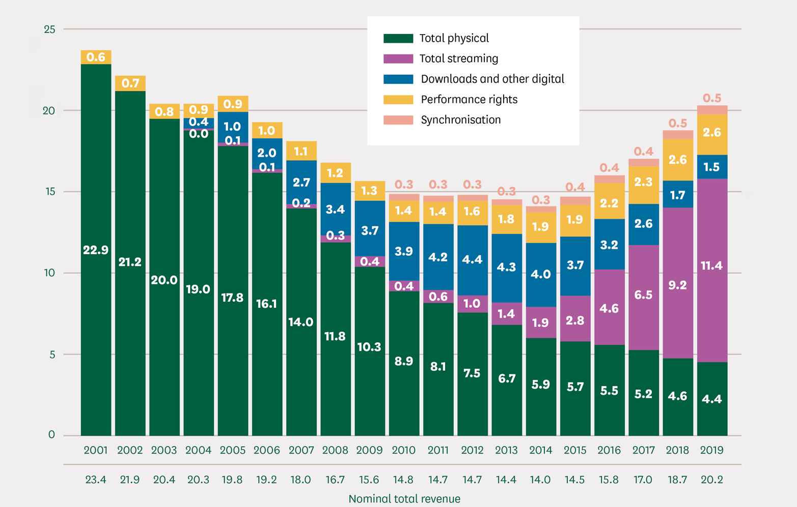

```{r setup, include=FALSE}

# options
knitr::opts_chunk$set(echo = FALSE)
```

# INTRODUÇÃO {-}

A economia está inserida na esfera social e, portanto, determinada por fenômenos sociais. Suas regras, normas e relações estão, por essa razão, sujeitas à geografia, tempo e estruturas de poder\footnote{Aqui me refiro às instituições que ora determinaram o \textit{ethos} vigente, como a igreja, aristrocacia ou o capital, por exemplo.}. Isso implica que seu funcionamento em raras ocasiões --- ou em nenhuma --- poderá ser explicado por *leis da natureza*, que, por definição, são imutáveis. E no caso dos bens culturais, há evidências de transformações profundas nos últimos anos.

Neste estudo, [...]

# FATOS ESTILIZADOS DA INDÚSTRIA CULTURAL NOS ANOS 2000

A indústria cultural tem sofrido mudanças profundas nos últimos 20 anos. Avanços tecnológicos, estrutura de receita e oligopolização são alguns dos fatores que afetaram várias dimensões do setor de bens culturais — cinematográfica, televisiva, musical, literária e até mesmo de jogos eletrônicos.

Dentre os fatores tecnológicos, a sequência de inovações nas mídias que culminaram no advento do *streaming* são de fundamental importância. No audiovisual, enquanto as mídias físicas --- fitas cassetes e vinis --- dominavam o mercado e a internet ainda não era largamente disponível, a pirataria era menos viável e de menor qualidade. Em 2001, 98% da receita da indústria da música gravada era oriunda das mídias físicas. Com a introdução do *compact disk* --- o CD---, a propagação da internet e a popularização de computadores com *drive* de disco, se torna simples a cópia física e digital da música gravada, dando ímpeto à pirataria. É nesse momento que sites especializados e tecnologias de compartilhamento, como o *torrent* e o P2P\footnote{Limeware, Kazaa e eMule, por exemplo.}, surgem. Lançado o iPod, em 2001, a transição para a mídia digital alcança também os reprodutores móveis, tornando obsoleto o *discman* e concluindo a transição da mídia analógica para a digital @commons.


```{r receitas, fig.cap = "Receita global da indústria da música (US\\$ bi)", out.width = '100%'}



```

# CARACTERIZAÇÃO TEÓRICA DO SETOR DE PRODUÇÃO DE BENS CULTURAIS

Para caracterizar o setor de produção de bens culturais, nos muniremos de @bourdieu e @herscovici. E, para que tal caracterização seja coerente, deve-se manter, na medida do possível, um método e um conjunto de conceitos coesos. Para tanto, analisaremos a seguir as quatro hipóteses acerca do produto cultural adotadas por @herscovici.

## HIPÓTESE #1

\begin{citacao}
Suponhamos que não seja possível raciocinar em termos de valor intrínseco da obra de arte. Isto significa simplesmente que as apreciações feitas a respeito da obra dependem, simultaneamente, da época e do grupo social considerado, assim como dos modos de validação em vigor. A obra só pode ser compreendida e apreciada se for recolocada no seu contexto histórico e sociológico; a universalidade da obra de arte é, portanto, limitada por estes fatores. \citep[p.~30]{herscovici}
\end{citacao}

Essa hipótese inviabiliza diretamente a caracterização do bem cultural como mercadoria no conceito de Marx:

\begin{citacao}
O que determina a grandeza do valor, portanto, é a quantidade de trabalho socialmente necessária ou o tempo e trabalho socialmente necessário para a produção de um valor-de-uso. Cada mercadoria individual é considerada aqui um exemplar médio de sua espécie. [...] A grandeza do valor de uma mercadoria permaneceria, portanto, invariável, se fosse constante o tempo de trabalho para sua produção. \citep[p.~61]{marx}
\end{citacao}

Se o bem cultural não possui valor intrínseco, este não pode ser medido pela quantidade de trabalho dispendida em seu processo de produção. Esse tipo de bem, por outro lado, parece, à primeira vista, compatível com o conceito de valor na teoria utilitarista:

\begin{citacao}
Ora, se há algum fato indiscutível sobre o valor de troca, é que ele não se refere de nehuma forma a um objeto, mas a uma circunstância de um objeto. Na verdade, o valor implica uma relação; mas se é assim, ele não pode ser \textit{alguma outra coisa}. Um estudante de Economia não poderá jamais ter esperança de alcançar idéias claras e corretas em sua ciência se conceber o valor de algum modo como uma \textit{coisa} ou um \textit{objeto}, ou mesmo como algo que esteja numa coisa ou objeto. As pessoas são assim levadas a falar de uma coisa não existente tal como \textit{valor intrínseco}. \citep[p.~66]{jevons}
\end{citacao}

## HIPÓTESE #2

\begin{citacao}
A atividade do produtor cultural, em relação ao jogo simbólico, deve aparece como "desinteressada": aparentemente, ela não corresponde a um comportamento econômico racional. Esta concepção, que vimos surgir desde o Renascimento, supõe a autonomia do campo cultural que aparece como um espaço social específico. Enfim, isso significa que o conjunto das racionalidades culturais se assemelha às racionalidades extra-econômicas, ou seja, a uma lógica dos fins. \citep[p.~31]{herscovici}
\end{citacao}

Tendo início por volta do século XV, a autonomização que o autor faz referência passa, necessariamente, pela constituição da demanda de bens simbólicos acima do ponto crítico em que profissionalização da atividade de produção desse tipo de bem se torna viável. Com a revolução industrial, essa formação é acelerada pela "extensão do público resultante da generalização do ensino elementar, capaz de permitir às novas classes (e às mulheres) o acesso ao consumo cultural (por exemplo, através da leitura de romances)" \citep[p.~102]{bourdieu}.

Essas condições permitem ao campo intelectual e artístico a, progessivamente, se libertar da tutela da ética e estética das instâncias de legitimidade externas — como a igreja e a corte —, e firmar suas próprias regras em uma tradição pautada na *arte pela arte*. Na medida que essa autonomia se desenvolve e se amplia, a classe artística passa a exercer em suas esferas de legitimização um controle exclusivo — tanto no sentido de privado, restrito, quanto no sentido de exclusão, pois cada vez mais exige o domínio de códigos de comunicação progressivamente mais complexos —, o que vai de encontro às características da mercadoria no *mainstream*.

A legitimização e avaliação de uma mercadoria no *mainstream* é definida pelo seu valor de uso e apreço — sua utilidade total e marginal, respectivamente — e, principalmente, por sua escassez \citep[p.~67-68]{jevons}. Em um ambiente concorrencial, esses elementos determinarão também seu preço. Entretanto, um campo de produção de bens culturais que visa exercer sua autonomia de forma exclusiva não pode ser ao mesmo tempo legitimizado externamente pelas relações de troca da mercadoria com o consumidor e nem pela utilidade de seus produtos culturais, tornando evidente sua incompatibilidade teórica com o *mainstream*.


## HIPÓTESE #3

\begin{citacao}
Cada produto cultural aparece e é percebido como único. Mesmo quando produzido industrialmente, ele mantém as características de um produto único. Apesar do mecanismo de formação dos preços de mercado, seu valor de uso é único e aleatório. A personalização extrema dos modos de valorização desses produtos, ligada ao desenvolvimento e à exacerbação do "star-system", permite a organização e a manutenção desta escassex. \citep[p.~31]{herscovici}
\end{citacao}

Suponha que a utilidade de um indivíduo seja definida pela seguinte função:
$$U(x,y)=x^\alpha y^\beta$$

Para que esse resultado pudesser ter alguma coerência, deveríamos aceitar que o consumo de dois bens culturais é melhor do que um. 


Em que $x$ represente a quantidade de bens culturais e $y$ a quantidade de outros bens. A dinâmica desse consumidor em relação aos bens culturais pode ser entendida pela taxa de variação de sua utilidade:
$$\frac{\frac{\partial U}{\partial x}}{U(x,y)} = \frac{\alpha x^{\alpha-1}y^\beta}{x^\alpha y^\beta} = \frac{\alpha}{x}$$

Esse resultado nos permitiria dizer que o consumo de mais um bem cultural aumentaria a utilidade total do consumidor em $\frac{\alpha}{x}$. 

-   escrever hipóteses (livro Alain, p.30) (hipotese 1: falar da otimização (snyder p. 147), h2: Bourdieu, h3: homogeneidade e valor em Menger , h4: ?)
-   mostrar que a metodologia neoclássica não é capaz de caracterizar teoricamente os bens culturais:
    -   função de produção, incluindo homogeneidade (p.27), utilidade ordinal x cardinal (impossibilidade somar utilidade ordinal) e star system
    -   leis de rendimentos marginais decrescentes
    -   função utilidade: consumo de duas músicas não é melhor do que de uma. Mostrar otimização restrita (renda e preços das músicas).

## UMA TEORIA PURA DA ARTE

A análise das hipóteses trazidas por \citet{herscovici} nos permite supor que, por conta das características do produto cultural, o *mainstream* seja inadequado para situar metodologicamente uma análise do setor de produção desses bens e, por consequência, deve-se buscar uma alternativa. Bourdieu propõe uma *teoria pura da arte*, que trate da dualidade do produto cultural como valor puramente simbólico e como mercadoria:

\begin{citacao}
[...] tudo leva a crer que a constituição da obra de arte como mercadoria e a aparição, devido aos progressos da divisão do trabalho, de uma categoria particular de produtores de bens simbólicos especificamente destinados ao mercado, propiciaram condições favoráveis a uma teoria pura da arte --- da arte como tal ---, instaurando uma dissociação entre a arte como simples mercadoria e a arte como pura significação, cisão produzida por uma intenção meramente simbólica e destinada à apropriação simbólica, isto é, a fruição desinteressada e irredutível à mera posse material. \citep[p.~103]{bourdieu}
\end{citacao}

O bem cultural pode, nessa concepção, ter ao mesmo tempo valor simbólico, ou seja, ser *arte*, e não estar ofertado no mercado, de forma que não seja *mercadoria*. Entretanto, enquanto mercadoria ele não deixa de ser arte, independentemente do quanto é sua legitimidade dentre a classe artística. Isso porque o valor simbólico do bem cultural depende da percepção do produtor ou do observador, que varia de acordo com o contexto social e histórico. Uma vez percebido como arte, o será \citep[p.~272]{bourdieu}.

- Tratar do setor de produção erudito e popular

# TESE

1. Com redução de receitas, fortalecimento do star system, causando oligopolização da indústria cultural;


# REFERÊNCIAS