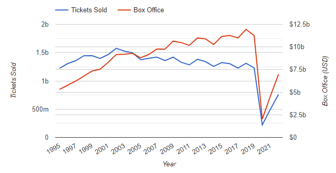
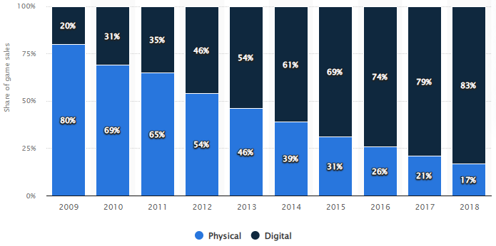
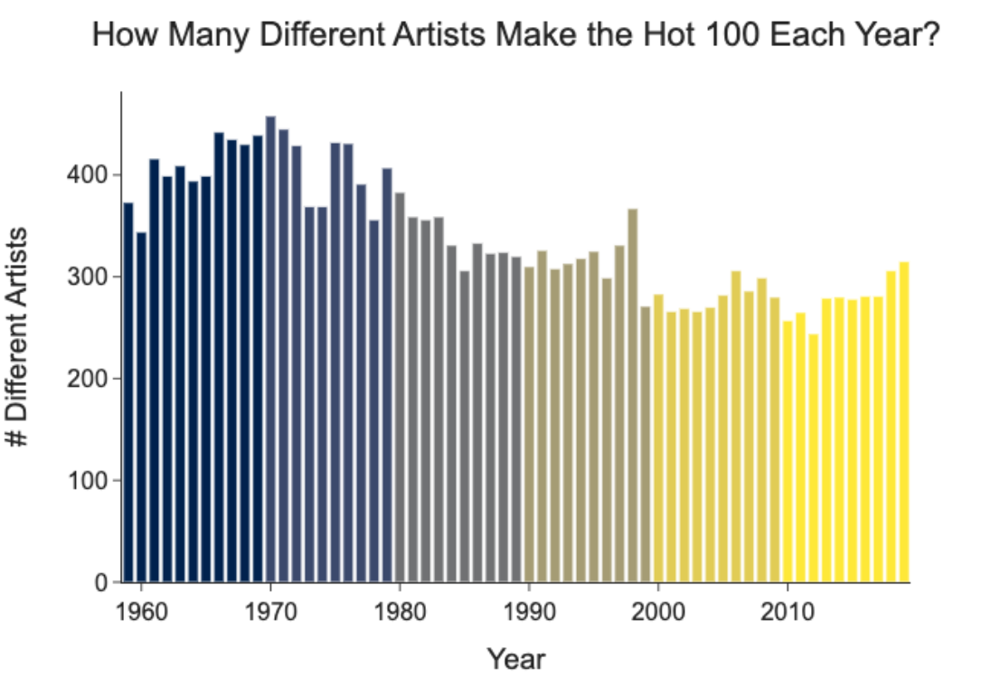
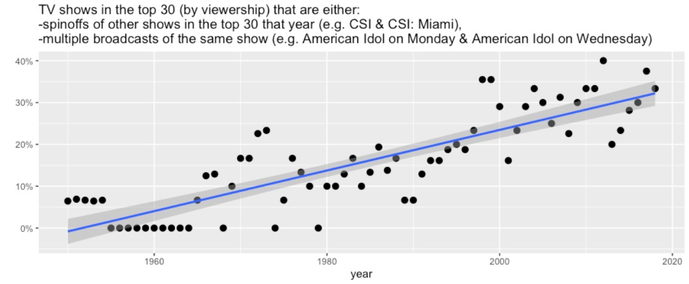
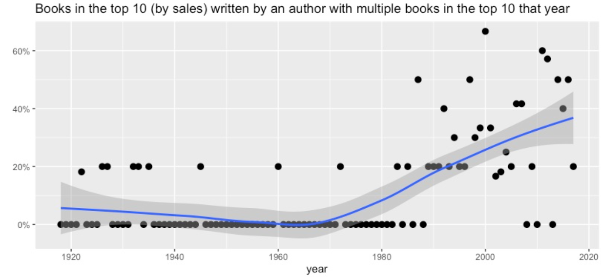

```{r setup, include=FALSE}

# options
knitr::opts_chunk$set(
  echo = FALSE,
  out.width = "70%",
  fig.align = "center"
)
```

\vspace{5cm}

# INTRODUÇÃO {-}

A economia está inserida na esfera social e, portanto, determinada por fenômenos sociais. Suas regras, normas e relações estão, por essa razão, sujeitas à geografia, tempo e estruturas de poder\footnote{Aqui me refiro às instituições que ora determinaram o \textit{ethos} vigente, como a igreja, aristrocacia ou o capital, por exemplo.}. Isso implica que seu funcionamento em raras ocasiões --- ou em nenhuma --- poderá ser explicado por *leis da natureza*, que, por definição, são imutáveis. E no caso dos bens culturais, há evidências de transformações profundas nos últimos anos.

Neste estudo, [...]

# FATOS ESTILIZADOS DA INDÚSTRIA CULTURAL NOS ANOS 2000

A indústria cultural tem sofrido mudanças profundas nos últimos 20 anos. Avanços tecnológicos, estrutura de receita e oligopolização são alguns dos fatores que afetaram várias dimensões do setor de bens culturais — cinematográfica, televisiva, musical, literária e até mesmo de jogos eletrônicos.

Dentre os fatores tecnológicos, a sequência de inovações nas mídias que culminaram no advento do *streaming* são de fundamental importância. No audiovisual, enquanto as mídias físicas --- fitas cassetes e vinis --- dominavam o mercado e a internet ainda não era largamente disponível, a pirataria era menos viável e de menor qualidade: em 2001, 98% da receita da indústria da música gravada era oriunda das mídias físicas. Com a introdução do *compact disk* --- o CD---, a propagação da internet e a popularização de computadores com *drive* de disco, se torna simples a cópia física e digital da música gravada, dando ímpeto à pirataria. É nesse momento que sites especializados e tecnologias de compartilhamento, como o *torrent* e o P2P\footnote{Limeware, Kazaa e eMule, por exemplo.}, surgem. Lançado o iPod, em 2001, a transição para a mídia digital alcança também os reprodutores móveis, tornando obsoleto o *discman* e concluindo a transição da mídia analógica para a digital [@commons, p. 9].

Uma vez colocadas as condições para replicação física e digital de forma viável, após alcançar seu ápice em 2001, a indústria da música gravada, que ainda dependia da venda de mídia física, sofreu ano após ano redução de receitas decorrente da pirataria. Entre 2002 e 2015, essa redução foi de 40% [@commons, p. 10]. De acordo com uma pesquisa citada na BBC, 20% dos europeus usavam P2P, enquanto apenas 10% deles usavam serviços pagos, como o iTunes [@bbc]. 

Enquanto tentativas para reverter esse quadro foram, em geral, insuficientes, o advento do *streaming* mudou completamente o cenário. Apesar da receita com mídia física continuar em queda, as receitas totais da indústria da música voltam a crescer em 2015 a partir da expansão e popularização global de serviços de *streaming*, como o Spotify e Deezer\footnote{O Spotify chega ao Brasil em 2014.}. Em países da Europa, observou-se, entre 2009 e 2011, queda de até 25% no números de pessoas deixando de consumir música pirateada [@commons, p. 12]; No Brasil, uma pesquisa constatou que, ainda em 2014, o consumo de músicas pirateadas era 31% menor dentre usuários de serviços de *streaming* [@g1]. Com isso, o *streaming* já representa mais da metade das receitas globais da indústria da música, tendo alcançado 56% em 2019 (figura \ref{fig:receita-musica}).

```{r receita-musica, fig.cap = "Receita global da indústria da música em US\\$ bi \\citep{commons}"}
knitr::include_graphics("img/receitas.png")
```

O mesmo fenômeno foi observado na indústria cinematográfica. Após alcançar a máxima história de ingressos vendidos em 2002, tanto as vendas de ingressos e a receita (ajustada pela inflação) em 2019 foram 2,3% menores que em 2014 (figura \ref{fig:receita-filmes}). Estudos\footnote{Ver \citet{frick} e \citet{welter}.} mostram que a disponibilização de um filme na Netflix é capaz de reduzir em mais de 10% a quantidade de *downloads* em sites de *torrents* nas primeiras semanas, ao mesmo tempo que a retirada de uma obra do catálogo aumenta em mais de 20% a busca no Google pela obra pirateada.

```{r receita-filmes, fig.cap = "Ingressos vendidos e receita do conema nos Estados Unidos em US\\$ \\citep{numbers}"}

```

Já na indústria de jogos eletrônicos, a mudança estrutural foi ainda mais profunda. Nos Estados Unidos, a mídia física, que representava 80% das vendas em 2009, passou para apenas 17% em 2018 (figura \ref{fig:receita-games}). Hoje já se tornou comum encontrar aparelhos sem unidade de disco --- como o Xbox Series S, versão de entrada dos consoles de última geração da Microsoft ---, que nem ao menos são compatíveis com mídia física [@statista].

```{r receita-games, fig.cap = "Proporção das vendas de jogos eletrônicos por mídia \\citep{statista}"}

```

Além dessas mudanças tecnológicas e na estrutura de receitas, também se tornou evidente a oligapolização do mercado de bens culturais. Na música, após alcançar o ápice na década de 70, a quantidade de artistas diferentes no ano compondo a tabela de músicas mais populares publicada pela revista Billboard decresceu significantemente (figura \ref{fig:oligo-musica}).

```{r oligo-musica, fig.cap = "Quantidade de artistas diferentes compondo a Billboard 100 por ano \\citep{experimentalhistory}"}

```

Na indústria cinematográfica, a proporção de filmes originais --- no sentido de que não são sequências, prequelas, *remakes* etc ---, dentre os filmes de maior receita no ano, que era em média maior que 70% na década de 80, caiu drasticamente a partir dos anos 2000, chegando a quase 10% em 2019 (figura \ref{fig:oligo-filmes}). Na TV, a proporção de *spinoffs* ou programas exibidos em mais de um dia na semana entre os 30 de maior audiência passou de pouco mais de 10% na década de 80 para quase 40% em 2019 (figura \ref{fig:oligo-tv}).

```{r oligo-filmes, fig.cap = "Filmes no \\textit{top} 20 de \\textit{box office} que são prequelas, sequências, \\textit{spinoffs}, \\textit{remakes}, \\textit{reboots} ou universo cinemático expandido \\citep{experimentalhistory}"}
knitr::include_graphics("img/oligo-filmes.png")
```

```{r oligo-tv, fig.cap = "Programas de TV dentre os 30 de maior audiência que são \\textit{spinoffs}ou são exibidos em mais de um dia na semana \\citep{experimentalhistory}"}

```

Essa mesma lógica se aplica também ao mercado literário. Enquanto a proporção de livros escritos por autores com mais de uma obra na lista de *best sellers* em um ano era, em média, zero nas décadas de 60 e 70, esse número alcançou 60% em 2011 (figura \ref{fig:oligo-livros}).

```{r oligo-livros, fig.cap = "Proporção de livros entre os mais 10 vendidos no ano por autores com mais de um livro no \\textit{top} 10 \\citep{experimentalhistory}"}

```

# CARACTERIZAÇÃO TEÓRICA DO SETOR DE PRODUÇÃO DE BENS CULTURAIS

Para analisar essas transformações, devemos primeiramente localizar o setor de produção de bens culturais em um campo teórico que seja coerente com as características e especificidades do bem cultural. Para tanto, nos muniremos da Economia da Cultura, através das obras de @bourdieu e @herscovici. O segundo escreve quatro hipóteses acerca do bem cultural que utilizaremos para, ao mesmo tempo, situar teoricamente seu setor de produção e justificar necessidade e relevância da Economia da Cultura.

## HIPÓTESE #1

\begin{citacao}
Suponhamos que não seja possível raciocinar em termos de valor intrínseco da obra de arte. Isto significa simplesmente que as apreciações feitas a respeito da obra dependem, simultaneamente, da época e do grupo social considerado, assim como dos modos de validação em vigor. A obra só pode ser compreendida e apreciada se for recolocada no seu contexto histórico e sociológico; a universalidade da obra de arte é, portanto, limitada por estes fatores. \citep[p.~30]{herscovici}
\end{citacao}

A economia política produziu, ao longo dos últimos 250 anos, teorias que tentam explicar as relações econômicas a partir da mercadoria e os elementos ao seu redor: como sua produção, circulação e distribuição. Os teóricos clássicos e depois Marx, de um lado, pensam na mercadoria como detentora de um valor intrínseco determinado em seu processo de produção:

\begin{citacao}
O que determina a grandeza do valor, portanto, é a quantidade de trabalho socialmente necessária ou o tempo e trabalho socialmente necessário para a produção de um valor-de-uso. Cada mercadoria individual é considerada aqui um exemplar médio de sua espécie. [...] A grandeza do valor de uma mercadoria permaneceria, portanto, invariável, se fosse constante o tempo de trabalho para sua produção. \citep[p.~61]{marx}
\end{citacao}

Essa hipótese inviabiliza diretamente a caracterização do bem cultural como mercadoria no conceito clássico: se o bem cultural não possui valor intrínseco, este não pode ser medido pela quantidade de trabalho dispendida em seu processo de produção. Ao contrário, o valor atribuído ao bem cultural é seu valor de uso que está associado ao seu valor simbólico --- que, por sua vez, está associado *ethos* vigente ---, e é, portanto, definido fora da esfera de produção. Esse tipo de bem, por outro lado, parece, à primeira vista, compatível com a mercadoria na teoria utilitarista:

\begin{citacao}
O valor é a importância que determinados bens concretos --- ou quantidades concretas de bens --- adquirem para nós, pelo fato de estarmos conscientes de que só poderemos atender às nossas necessidades na medida em que dispusermos deles. \citep[p.~283]{menger}
\end{citacao}

Entretanto, quando se trata de bens culturais, existe uma discussão ainda anterior: o bem cultural é mercadoria? Assim como no processo de produção de outros tipos de bens, há o trabalho concreto realizado --- aqui pelos artista e demais trabalhadores do setor de produção do bem cultural. Na medida em que esse trabalho obtém sucesso em adquirir valor simbólico, ou seja, é reconhecido como obra de arte, ele se torna um bem cultural. Entretanto, este bem apenas obtém *status* de mercadoria se também for legitimizado pelo mercado, adquirindo valor social que é traduzido em preço \citep[p.~170]{herscovici}. Uma característica que diferencia a mercadoria cultural das demais é que esse valor social não está relacionado com o trabalho concreto realizado, mas é aleatório. Além disso, o sucesso em transformar o trabalho concreto em valor social não é requisito necessário para a produção do bem cultural: enquanto não faz sentido imaginar uma fábrica que entregue seus produtos gratuitamente, uma espécie de *manufatura por manufatura*, 50% dos artistas com obras disponíveis no Spotify **não** são remunerados e 87% recebem menos de £200 no ano \citep[p.~26-27]{commons}. Isso evidencia uma especificidade do setor de produção de bens culturais, o que nos leva à segunda hipótese.

## HIPÓTESE #2

\begin{citacao}
A atividade do produtor cultural, em relação ao jogo simbólico, deve aparece como "desinteressada": aparentemente, ela não corresponde a um comportamento econômico racional. Esta concepção, que vimos surgir desde o Renascimento, supõe a autonomia do campo cultural que aparece como um espaço social específico. Enfim, isso significa que o conjunto das racionalidades culturais se assemelha às racionalidades extra-econômicas, ou seja, a uma lógica dos fins. \citep[p.~31]{herscovici}
\end{citacao}

Tendo início por volta do século XV, a autonomização que o autor faz referência passa, necessariamente, pela constituição da demanda de bens simbólicos acima do ponto crítico em que profissionalização da atividade de produção desse tipo de bem se torna viável. Com a revolução industrial, essa formação é acelerada pela "extensão do público resultante da generalização do ensino elementar, capaz de permitir às novas classes (e às mulheres) o acesso ao consumo cultural (por exemplo, através da leitura de romances)" \citep[p.~102]{bourdieu}.

Essas condições permitem ao campo intelectual e artístico a, progessivamente, se libertar da tutela da ética e estética das instâncias de legitimidade externas — como a igreja e a corte —, e firmar suas próprias regras em uma tradição pautada na *arte pela arte*. Na medida que essa autonomia se desenvolve e se amplia, a classe artística passa a exercer em suas esferas de legitimização um controle exclusivo — tanto no sentido de privado, restrito, quanto no sentido de exclusão, pois cada vez mais exige o domínio de códigos de comunicação progressivamente mais complexos —, encerrando a compatibilidade aparente entre a mercadoria na teoria utilitarista e na economia cultural.

A legitimização e avaliação de uma mercadoria no sentido utilitarista é definida pelo seu valor de uso e apreço — sua utilidade total e marginal, respectivamente — e, principalmente, por sua escassez \citep[p.~67-68]{jevons}. Em um ambiente concorrencial, esses elementos determinarão também seu preço. Entretanto, um campo de produção de bens culturais que visa exercer sua autonomia de forma exclusiva não pode ser ao mesmo tempo legitimizado externamente pelas relações de troca da mercadoria com o consumidor e nem pela utilidade de seus produtos culturais.


## HIPÓTESE #3

\begin{citacao}
Cada produto cultural aparece e é percebido como único. Mesmo quando produzido industrialmente, ele mantém as características de um produto único. Apesar do mecanismo de formação dos preços de mercado, seu valor de uso é único e aleatório. A personalização extrema dos modos de valorização desses produtos, ligada ao desenvolvimento e à exacerbação do "star-system", permite a organização e a manutenção desta escassez. \citep[p.~31]{herscovici}
\end{citacao}

A heterogeneidade do bem cultural é uma característica definidora da dinâmica da economia cultural. Por essa razão, técnicas adotadas em modelos micro e macroeconômicas traidionais como funções de produção e dinâmicas de produto único não são capazes de explicar seu funcionamento. Já a Economia da Cultura reconhece e abraça essa heterogeneidade, uma vez que é ela que permite o surgimento de um *star-system* que se torna o modo de produção dominante no setor de produção de bens culturais.

Esse sistema é caracterizado pela manutenção e legitimação da escassez na economia:

\begin{citacao}
A "administração" da oferta consiste em diminuir, ou seja, rarear, quantitativa e qualitativamente, os produtos oferecidos, provocando, desta forma, uma rigidez da oferta e da demanda. [...] A rigidez-preço da demanda é reveladora dessa economia com produtos altamente diferenciados, e se manifesta por uma maximização do aumento dos preços de certos produtos. \citep[p.~172-173]{herscovici}
\end{citacao}

Dessa forma, a heterogeneidade dos bens culturais é condição necessária para o *star-system* que, por sua vez, é essencial para explicar o processo de oligopolização característico da indústria cultural.

## HIPÓTESE #4

\begin{citacao}
A função do produto cultural é produzir sentido: o valor simbólico é determinante e precede, obrigatoriamente, o valor econômico. Os processos de apropriação material desses bens e serviços estão condicionados, previamente, pela apropriação simbólica; porém, tal apropriação depende da estruturação social própria da formação social estudada. \citep[p.~32]{herscovici}
\end{citacao}

O bem cultural pode, nessa concepção, ter ao mesmo tempo valor simbólico, ou seja, ser *arte*, e não estar ofertado no mercado, de forma que não seja *mercadoria*. Entretanto, enquanto mercadoria ele não deixa de ser arte, independentemente do quanto é sua legitimidade dentre a classe artística. Isso porque o valor simbólico do bem cultural depende da percepção do produtor ou do observador, que varia de acordo com o contexto social e histórico. Uma vez percebido como arte, o será \citep[p.~272]{bourdieu}. Isso permitiria, inclusive, a formação de dois setores de produção de bens culturais distintos: o campo de produção erudito e a indústria cultural:

\begin{citacao}
[...] tudo leva a crer que a constituição da obra de arte como mercadoria e a aparição, devido aos progressos da divisão do trabalho, de uma categoria particular de produtores de bens simbólicos especificamente destinados ao mercado, propiciaram condições favoráveis a uma teoria pura da arte --- da arte como tal ---, instaurando uma dissociação entre a arte como simples mercadoria e a arte como pura significação, cisão produzida por uma intenção meramente simbólica e destinada à apropriação simbólica, isto é, a fruição desinteressada e irredutível à mera posse material. \citep[p.~103]{bourdieu}
\end{citacao}

O campo de produção erudito, com o objetivo de alcançar maximizar o valor simbólico, produz, ao menos num primeiro momento, para os próprios produtores de bens culturais, que são ao mesmo tempo clientes e concorrentes, e estabelece suas próprias regras de legitimização e apropriação de valor simbólico. Já a indústria cultural visa o grande público e se coloca subordinado aos detentores dos instrumentos de produção e difusão da arte, obedecendo e sendo determinado pela lógica do mercado concorrencial.

# NATUREZA DAS TRANSFORMAÇôES SOB A ÓTICA DA ECONOMIA DA CULTURA

Munidos de um corpo teórico coerente em razão do objeto estudado, podemos analisar algumas das profundas transformações que a economia cultural tem sofrido nos últimos anos. A partir do advento da série de inovações tecnológicas mencionadas na primeira seção, que são exógenas ao setor de produção de bens culturais, e a consequente mudança na estrutura de receitas que elas causam, a produção artística, que já apresenta a oligopolização como característica intrínseca, fortalece ainda mais o mecanismo que a gera: o *star-system*. Esse mecanismo acelera o processo de oligopolização da indústria cultural e pode ser visto como o cerne endógeno das transformações recentes na economia cultural:

\begin{citacao}
A organização da escassez, na forma estabelecida pelo \textit{star-system}, gera monopólios temporais. Os artistas consagrados, que têm capacidade de mobilizar a energia simbólica do campo, se beneficiam das rendas de monopólio. Dividem essas rendas com os "banqueiros simbólicos".

Finalmente, a estrutura monopolística tem dificuldade em assegurar a reprodução da força de trabalho artística. Estudos empíricos mostram que a maioria da população artística não consegue sobreviver unicamemnte da atividade artística, também nesse caso não há nenhuma regulação global que assegure a reprodução, mesmo simples, do sistema. \citep[p.~174-175]{herscovici}
\end{citacao}

Somado à especificidade da formação de valor de uso e valor econômico no produto cultural, o *star-system* também acaba por afetar a estrutura de receitas do campo de produção desse tipo de bem. Primeiro, porque as especificidades da atividade artística causam a exteriorização de sua força de trabalho. Em segundo, o *star-system*, ao regular a escassez e causar uma tendência à oligapolização da indústria cultural, acaba por criar barreiras à entrada e fragilizar a própria manutenção da força de trabalho artística:

\begin{citacao}
[...] ou não existe assalariamento da força de trabalho e esta é remunerada em função das receitas aleatórias ligadas à venda do produto (direitos autorais, royalties), ou tal assalariamento é parcial e parte da renda depende dessas mesmas receitas aleatórias (o cinema é prepresentativo desta situação). Nos dois casos há \textit{exteriorização da força de trabalho artística em relação ao processo global de produção}. \citep[p.~173-174]{herscovici}
\end{citacao}

Embora essa característica não seja nova à classe artística, as inovações tecnológicas que acabaram por estimular a pirataria afetaram drasticamente a renda do setor de uma forma que aparenta ter sido irreversível.

1. FALAR SOBRE O EXCEDENTE DO CONSUMIDOR
1. COMO A INDUSTRIA EXACERBOU O STAR SYSTEM PARA RECUPERAR RECEITA

# REFERÊNCIAS