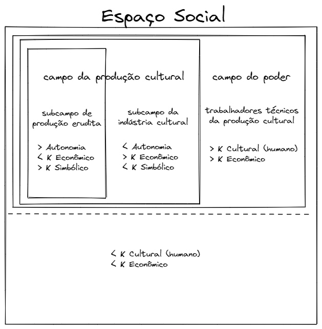
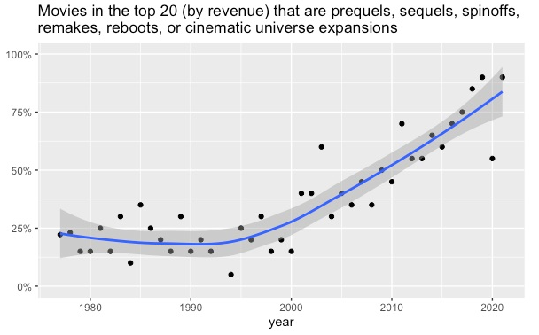
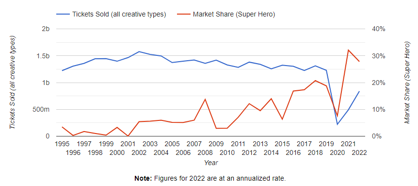

```{r setup, include=FALSE}

# options
knitr::opts_chunk$set(
  echo = FALSE,
  out.width = "70%",
  fig.align = "center"
)
```

\vspace{5cm}

# MOTIVAÇÃO E PROBLEMA {-}

Por vários séculos, um problema desafiou a criatividade dos estudiosos do cosmos: por que o céu é escuro à noite? Se o universo é infinito em espaço e infinito em tempo, como se pensava, para qualquer direção que se olhasse no céu, enventualmente se chegaria numa estrela. Por mais indiscritivelmente distante ela estivesse, havendo um tempo infinito no passado, a sua luz nos teria alcançado e não haveria noite --- todo o céu noturno estaria repleto de estrelas.

Apesar de ter sido trabalhado por astrônomos brilhantes --- como Kepler, Halley e Chéseaux ---, esse problema, conhecido como o paradoxo de Olbers, encontrou uma resposta científicamente coerente pela mente do poeta e escritor Edgar Allan Poe em 1848. Ele formula que se o universo é infinito em espaço e o céu é escuro à noite, então ele não pode ser infinito em tempo, sugerindo que ele teria um início e não teria havido tempo o suficiente para que a luz das estrelas mais distantes nos alcançasse. Foi com esse paradoxo em mente que me veio a questão desta tarefa.

No que concerne o processo de oligopolização do setor de produção de bens culturais, se a diferenciação é uma de suas características intrínsecas, presente desde sua constituição como setor autônomo no séc. XIX, por que apenas a partir das décadas de 1970 e 1980 que o setor inicia (ou intensifica) um processo de oligopolização\footnote{Para evitar repetição, não estou colocando os dados e evidências da aceleração desse processo discutidos no trabalho anterior.}?

Assim como na formulação de Poe, podemos argumentar que esse processo é característico e tem se desenrolando ao longo do tempo, porém os pouco menos de 200 anos desde seu início não teriam sido suficientes para sua conclusão. Entretanto, se não houve mudança estrutural na produção artística desde a conclusão de sua autonomização (e constituição dos subcampos de produção erudita e da indústria cultural), então não haveria razão para que o processo monopolístico tenha se intensificado e acelerado na segunda metade do século XX. Então, *alguma mudança deve ter ocorrido no setor de produção de bens culturais nesse período*. E é essa mudança que discute-se neste trabalho.

# INTRODUÇÃO

Na tarefa anterior, relacionei a oligopolização do setor de produção de bens culturais a três elementos. Primeiro, o advento de uma série de inovações tecnológicas exógenas ao setor de produção de bens culturais --- o *compact disk*; a disponibilização da internet nos setores populares e sua contínua melhoria de performance; tecnologias de compartilhamento *peer to peer* e; formatos de mídias digitais são algumas dessas inovações --- reduz a complexidade da replicação e viabiliza economicamente a pirataria.

O segundo elemento, que ocorre em decorrência do primeiro, é a mudança na estrutura de receitas do setor. As transformações tecnológicas acima mencionadas afetam duplamente (e negativamente) a indústria cultural: ao mesmo tempo em que os consumidores passam a consumir o produto pirateado, a mídia física perde relevância e a principal forma de consumo e circulação de bens culturais passa a ser em formato lógico --- um arquivo *.mp3*, um vídeo *.avi* ou um livro em *.pdf* ou *e-book*. Consequentemente, a receita do setor, concentrada na comercialização da mídia física, é reduzida drasticamente.

O terceiro elemento é a exacerbação do *star-system*. Subordinada à lógica capitalista e à luz de tamanha ameaça à sua lucratividade, que reduz quase à metade ao longo de uma década\footnote{\citep{commons}.}, é apenas coerente que os detentores dos instrumentos de produção e difusão dos bens culturais, associados ao mercado publicitário midiático, buscassem fortalecer a ilusão do consenso ao redor de suas estrelas — seus artistas consagrados que dominam o mercados e são sua principal fonte de receita. Esse, portanto, é o mecanismo por trás da oligopolização da produção de bens culturais.

Entretanto, essa estrutura monopolística por si só não explica o porquê da aceleração do processo na segunda metade do séc. XX. Afinal, o fim da era da mídia física ocorre apenas nos anos 2000, mas a oligopolização começa a acelerar cerca de 30 anos antes.

# A TEORIA DOS CAMPOS DE BOURDIEU

Para entender a estrutura do campo de produção cultural, nos muniremos mais uma vez de \citet{bourdieu}. Ele organiza a produção cultural em estruturas de campos cujas posições e interrelações são determinadas por quantidades ordinais de diferentes tipos de capital --- capital cultural (ou humano, pelo que interpretei mas não estou seguro), capital econômico e capital simbólico. 

O campo da produção cultural é o que possui capital simbólico e, se o valor simbólico precede o valor econômico, é onde o valor é gerado. Bourdieu diz que esse campo é, em sua forma final, autônomo em relação ao campo do poder.

## FORMAÇÃO E AUTONOMIZAÇÃO DO CAMPO DE PRODUÇÃO CULTURAL

Bourdieu coloca três etapas durante a formação do campo de produção cultural. A primeira etapa é a transição da produção cultural, que parte de uma situação de submissão ao *ethos* do campo do poder --- representadas por instituições como a igreja, a aristocracia e os mecenatos ---, para um campo autônomo. Com a formação da burguesia e, consequentemente, de um público consumidor extenso e diversificado o suficiente para viabilizar a profissionalização da atividade de produção cultural; com a crescente formação de novos produtores e empresários de bens simbólicos, e; com a multiplicação e diversificação de espaços de consagração simbólica, o campo intelectual e artístico cria alguma autonomia da tutela ética e estética das instâncias de legitimidade externas e se constitui como campo autônomo [@bourdieu, p. 100].

A segunda etapa consiste no surgimento da estrutura dual do campo de produção de bens culturais: o subcampo de produção erudita e o subcampo da indústria cultural. O primeiro emerge por volta de 1830, a partir de um processo de fechamento em si, negando e se colocando em oposição ao subcampo da indústria cultural. Ele, no esquema de Bourdieu, está hierarquicamente em posição superior ao outro subcampo, no sentido de possuir maior autonomia, que se reflete "no poder de que dispõe para definir as normas de sua produção, os critérios de avaliação de seus produtos e, portanto, para retraduzir e reinterpretar todas as determinações externas de acordo com seus princípios próprios de funcionamento" [@bourdieu, p. 106].

A terceira etapa então é o mercado de bens simbólicos em sua forma completa e, na análise de Bourdieu, atual, composta das interrelações resumidas brevemente no quadro abaixo.

```{r campos, fig.cap = "Estrutura de campos de Bourdieu"}

```

# O SETOR DE PRODUÇÃO DE BENS CULTURAIS NA ERA DAS CORPORAÇÕES

A ideia do artista como um ser livre, criativo e vanguardista está enraizada no imaginário popular. Isso nos impediria a enxergar a atuação e influência do campo do poder na produção cultural. O produtor visível é o artista --- que na teoria dos campos está localizado no campo da produção cultural ---, que para o consumidor sumariza todo o papel e responsabilidade criativa. Entretanto, o produtor invisível, este localizado no campo do poder, dependendo do nível de autonomia do artista, é quem vai *criá-lo*, influenciando sua produção simbólica. A chave, então, está em entender se há, durante a segunda metade do séc. XX, uma *mudança estrutural no espaço social que afeta o nível de autonomia do campo da produção cultural*.

De acordo com @hesmondhalgh, o entendimento do desenvolvimento histórico de Bourdieu falha exatamente ao ignorar as "profound transformations in the field of cultural production in the 20th century, in particular the growth and expansion of the cultural industries --- central to which are the media industries". O autor argumenta, nesse sentido, que a formulação de Raymond Williams, que consiste em quatro etapas, é mais adequada para descrever o desenvolvimento da produção cultural:

\begin{citacao}
In my view, Raymond Williams offers a superior understanding of the historical development of cultural production in his book Culture (1981), when he writes of four stages or phases in the social relations of creators with the institutions of cultural production and with wider society: the artisanal, the post-artisanal (including patronage), the market professional,
which is akin to the 19th-century states of the field much more fully described by Bourdieu, and finally, from the early 20th century onwards, but enormously intensifying in the second half of that century, the corporate professional stage. \citep[p.~219]{hesmondhalgh}
\end{citacao}

Essas corporações não são meramente versões maiores das sociedades empresariais do séc. XIX. Isso porque, com a chegada da mídia publicitária profissional, as preferências do consumidor médio influenciam não apenas as receitas do mercado de bens simbólicos, mas também as receitas de uma grande variedade de bens materiais de outras industrias --- *merchandising* em geral, como camisas, brinquedos, copos etc. Portanto, elas não poderiam deixar que o campo da produção cultural gozassem da mesma autonomia, uma vez que a reprodução de seu capital econômico depende da manutenção e controle das preferências culturais do consumidor médio.

Nessa era em que as grandes corporações detém um nível de concentração de capital econômico *muito* superior ao de suas predecessoras, as microrrelações que habitam o espaço social sofrem uma mutação significativa no que concerne a autonomia do campo de produção cultural: as relações sociais dos produtores culturais com o campo de poder começam a caminhar no sentido contrário ao qual se moviam; ao invés de uma crescente autonomia, voltam à direção da relação de emprego. As corporações culturais profissionais contratam o artista para executarem as ideias das corporações, e não do artista. Assim, o produto cultural é aquele concebido não pelo artista autônomo, mas pelos profissionais intermediários --- produtores, editores, empresários etc.

Tome a oligopolização da indústria cinematográfica, por exemplo. A proporção de filmes originais — no sentido de que não são sequências, prequelas, remakes etc —, dentre os filmes de maior receita no ano, que era em média maior que 70% na década de 80, caiu drasticamente a partir dos anos 2000, chegando a quase 10% em 2019.

```{r filmes, fig.cap = "Filmes no top 20 de box office que são prequelas, sequências, spinoffs, remakes, reboots ou universo cinemático expandido \\citep{experimentalhistory}."}

```

O *benchmark* da indústria em termos de receita nos últimos anos é o gênero de super-herói. Enquanto as vendas de ingressos de cinema seguem tendência de queda desde 2003, o gênero aumenta sua participação na receita da indústria de forma acelerada, passando da média de 1,78% entre 1995-2000 a incríveis 32% no ano de 2021.

```{r super, fig.cap = "Market-share do gênero de super-herói \\citep{numbersheroi}."}

```

O capital econômico das grandes corporações --- aqui a Fox, Sony, DC e, principalmente, Marvel ---, associado ao mecanismo argumentado por Hesmondhalgh, é essencial para explicar o processo de oligopolização. No exemplo da indústria cinematográfica, a execução das ideias das corporações, ou seja, de profissionais intermediários, ao invés das ideias dos produtores culturais é uma das razões que, junto à exacerbação do *star-system*, implicam na redução da diferenciação.

Esse argumento não é exagerado. Note que Kevin Feige, produtor e executivo da Marvel Studios, declarou em entrevista, ainda em 2014, ter lançamentos de filmes do universo cinematográfico expandido do estúdio planejados para 2028 \citep{screenrant}. Para ilustrar a lógica corporativa, um dos títulos planejados era *Untitled Sony Spin-Off of Spider-Man With a Female Lead* \citep{ign}. De mão desse escopo, contrata-se então roteiristas e diretores que executam a ideia do estúdio. A mesma lógica, explica Hesmondhalgh, também se aplica a outras indústrias culturais, como a literária:

\begin{citacao}
In this most recent stage, "social relations typical of the integrated professional market" persist, but, Williams notes, in the context of book publishing, the important emergence of an
increasingly capitalized corporate sector, where for many writers the "most available social relations are those of employment . . . with the ideas for books coming from new professional intermediaries (publishers" editors) within the market structure, and authors being employed to execute them" (1981: 52). (Many authors would like to execute their editors, and vice versa, but Williams means that authors are employed to execute the ideas of their editors.). \citep[p.~219]{hesmondhalgh}
\end{citacao}

Em conclusão, argumentamos que Bourdieu, no desenvolvimento histórico da sua teoria de campos, ignora uma transformação estrutural importante no campo do poder: o advento das corporações incrivelmente capitalizadas. Esse *gap* em sua teoria talvez seja importante para explicar a razão da aceleração do processo de oligopolização do campo de produção cultural na segunda metade do séc. XX.

# REFERÊNCIAS