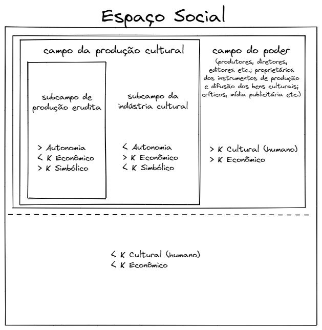

```{r setup, include=FALSE}

# options
knitr::opts_chunk$set(
  echo = FALSE,
  out.width = "70%",
  fig.align = "center"
)
```

\vspace{5cm}

# MOTIVAÇÃO E PROBLEMA {-}

Por vários séculos, um problema desafiou a criatividade dos estudiosos do cosmos: por que o céu é escuro à noite? Se o universo é infinito em espaço e infinito em tempo, como se pensava, para qualquer direção que se olhasse no céu, enventualmente se chegaria numa estrela. Por mais indiscritivelmente distante ela estivesse, havendo um tempo infinito no passado, a sua luz nos teria alcançado e não haveria noite --- todo o céu noturno estaria repleto de estrelas.

Apesar de ter sido trabalhado por astrônomos brilhantes --- como Kepler, Halley e Chéseaux ---, esse problema, conhecido como o paradoxo de Olbers, encontrou uma resposta científicamente coerente pela mente do poeta e escritor Edgar Allan Poe em 1848. Ele formula que, se o universo é infinito em espaço e o céu é escuro à noite, então ele não pode ser infinito em tempo, sugerindo que ele teria um início e não teria havido tempo o suficiente para que a luz das estrelas mais distantes nos alcançasse. Foi com esse paradoxo em mente que me veio a questão desta tarefa.

No que concerne o processo de oligopolização do setor de produção de bens culturais, se a diferenciação é uma de suas características intrínsecas, presente desde sua constituição como setor autônomo por volta do séc. XV, por que apenas a partir das décadas de 1970 e 1980 que o setor inicia (ou intensifica) um processo de oligopolização\footnote{Para evitar repetição, não estou colocando os dados e evidências da aceleração desse processo discutidos no trabalho anterior.}?

Assim como na formulação de Poe, podemos argumentar que esse processo é natural e apenas não havia decorrido tempo suficiente para sua conclusão. Entretanto, isso não explica o porquê desse processo ter se intensificado e acelerado na segunda metade do século XX. Então, *alguma mudança deve ter ocorrido no setor de produção de bens culturais nesse período*. E é essa mudança que buscaremos neste trabalho.

# INTRODUÇÃO

Na tarefa anterior, relacionei a oligopolização do setor de produção de bens culturais a três elementos. Primeiro, o advento de uma série de inovações tecnológicas exógenas ao setor de produção de bens culturais --- o *compact disk*; a disponibilização da internet nos setores populares e sua contínua melhora de performance; tecnologia de compartilhamento *peer to peer* e; formatos de mídias digitais são algumas dessas inovações --- reduz a complexidade da replicação e viabiliza economicamente a pirataria.

O segundo elemento, que ocorre em decorrência do primeiro, é a mudança na estrutura de receitas do setor. As transformações tecnológicas acima mencionadas afetam duplamente (e negativamente) a indústria cultural: ao mesmo tempo em que os consumidores passam a consumir o produto pirateado, a mídia física perde relevância e a principal forma de consumo e circulação de bens culturais passa a ser em formato lógico --- um arquivo *.mp3*, um vídeo *.avi* ou um livro em *.pdf* ou *e-book*. Consequentemente, a receita do setor, concentrada na comercialização da mídia física, cai drasticamente.

O terceiro elemento é a exacerbação do *star-system*. Subordinada à lógica capitalista e à luz de tamanha ameaça à sua lucratividade, é apenas coerente que os detentores dos instrumentos de produção e difusão dos bens culturais, associados ao mercado publicitário midiático, buscassem fortalecer a ilusão do consenso ao redor de suas estrelas — seus artistas consagrados que dominam o mercados e são sua principal fonte de receita. Esse, portanto, é o mecanismo por trás da oligopolização da produção de bens culturais.

Entretanto, essa estrutura monopolística por si só não explica o porquê da aceleração do processo na segunda metade do séc. XX. Afinal, o fim da era da mídia física ocorre apenas nos anos 2000, mas a oligopolização começa a acelerar cerca de 30 anos antes.

# A TEORIA DOS CAMPOS DE BOURDIEU

Para entender a estrutura do campo de produção cultural, nos muniremos mais uma vez de \citet{bourdieu}. Ele organiza a produção cultural em estruturas de campos cujas posições e interrelações são determinadas por quantidades ordinais de diferentes tipos de capital --- capital cultural (ou humano, pelo que interpretei mas não estou seguro), capital econômico e capital simbólico. Essas interrelações estão resumidas no quadro a seguir:

```{r campos, fig.cap = "Estrutura de campos de Bourdieu"}

```

O campo da produção cultural é o que possui capital simbólico e, se o valor simbólico precede o valor econômico, é onde o valor é gerado. Bourdieu diz que esse campo é autônomo em relação ao campo do poder.

## FORMAÇÃO E AUTONOMIZAÇÃO DO CAMPO DE PRODUÇÃO CULTURAL

Bourdieu coloca três etapas durante a formação do campo de produção cultural. A primeira, 

# O SETOR DE PRODUÇÃO DE BENS CULTURAIS NA ERA DAS CORPORAÇÕES

A ideia do artista como um ser livre, criativo e vanguardista está enraizada no imaginário popular. Isso nos impediria a enxergar a atuação e influência do campo do poder na produção cultural. O produtor visível é o artista --- que na teoria dos campos está localizado no campo da produção cultural ---, que para o consumidor sumariza todo o papel e responsabilidade criativa. Entretanto, o produtor invisível, este localizado no campo do poder, dependendo do nível de autonomia do artista, é quem vai *criar* o artista, influenciando sua produção simbólica.

# REFERÊNCIAS